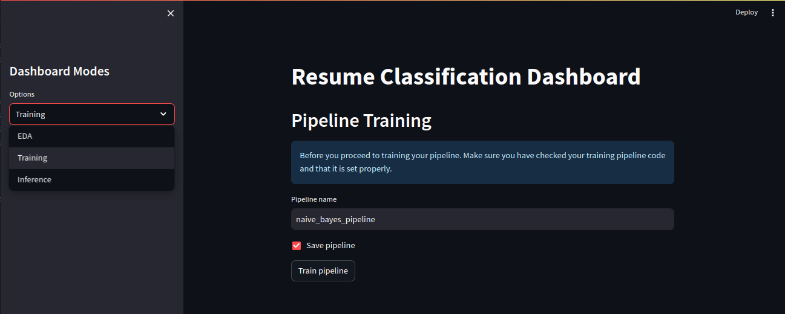
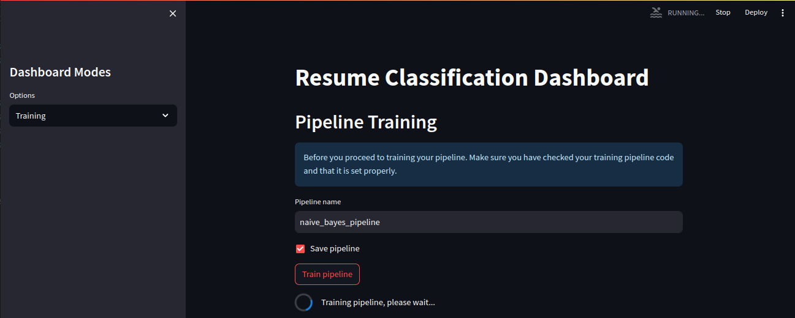
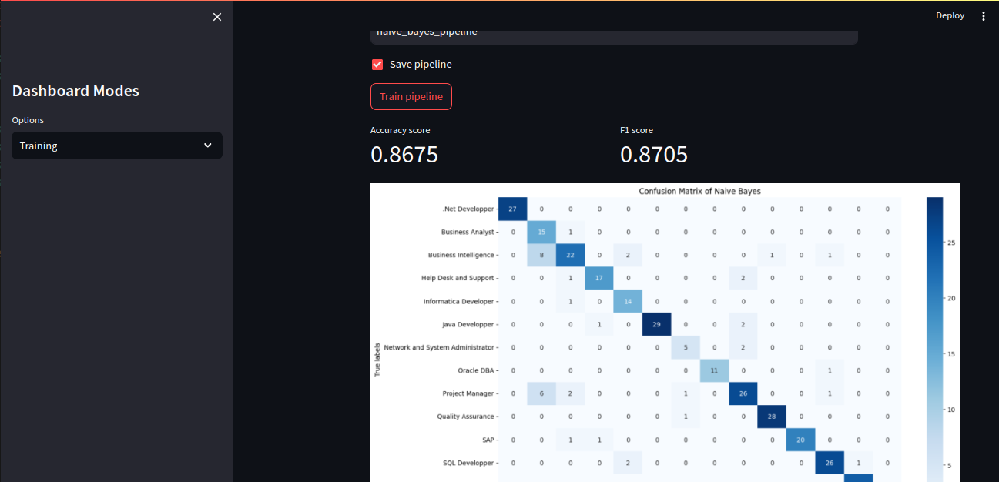
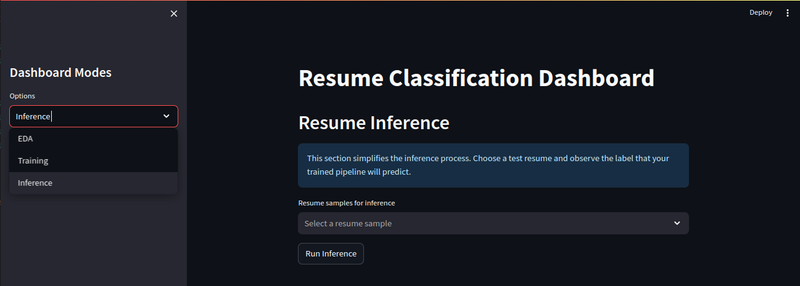
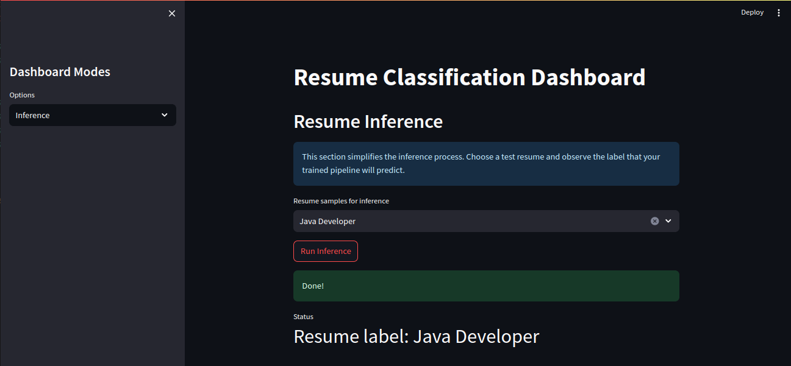

# ML-Internship-Home-Assignment

## Requirements
- Python 3.9 or higher.

#### - Install Poetry on your global Python setup
Follow the official [Poetry installation guide](https://python-poetry.org/docs/#installation) to install Poetry on your system.

 - Install requirements
```bash
    cd data-ml-home-assignment
    
    poetry install
```
- Activate the virtual environment

```bash
    poetry shell
```
#### - Start the application
```sh
    sh run.sh
```
- API : http://localhost:8000
- Streamlit Dashboard : http://localhost:9000

P.S You can check the log files for any improbable issues with your execution.
## Before we begin
- In this assignement, you will be asked to write, refactor, and test code. 
- Make sure you respect clean code guidelines.
- Some parts of the already existing code are bad. Your job is to refactor them.
- Read the assignement carefully.
- Read the code thoroughly before you begin coding.

## Description
This mini project is a data app that revolves around resume text classification.

You are given a `dataset` that contains a number of resumes with their labels.

Each row of the dataset contains:
- Label 1, 2, ..., 13 You will find the resume labels map under data_ml_assignment/constants
- Resume text

The project contains by default:
- A baseline `naive bayes pipeline` trained on the aforementioned dataset
- An `API` that exposes an `inference endpoint` for predictions using the baseline pipeline
- A streamlit dashboard divided on three parts `(Exploratory Data Analysis, Training, Inference)`

## Assignment
### 1 - Code Refactoring
`Streamlit` is a component-based data app creator that allows you to create interactive dashboards using Python. 

While Streamlit is easy to use by "non frontenders", it can easily turn into a complicated piece of code.

As mentioned previously, the streamlit dashboard you have at hand is divided into 3 sections:
- Exploratory Data Analysis
- Training
- Inference

The code for the dashboard is written into one long Python (`dashboard.py`) script which makes it long, unoptimized, hard to read, hard to maintain, and hard to upgrade.

Your job is to:
- Rewrite the code while respecting `clean code` guidelines.
- `Refactor` the script and dissociate the components.
- Create the appropriate `abstraction` to make it easy to add components on top of the existing code.

`Bonus points`: if you pinpoint any other code anomalies across the whole project and correct them.

### 2 - Exploratory Data Analysis
In this section, you are asked to explore the dataset you are provided and derive insights from it:
- Statistical Descriptions
- Charts

Your EDA must be added to the first section of the streamlit dashboard.

P.S: You can add data processing in this section if needed.


Hints: Please refer to the [documentation](https://docs.streamlit.io/library/api-reference) to learn more on how to use Streamlit `widgets` in order to display: `pandas dataframes`, `charts`, `tables`, etc, as well as interactive components: `text inputs`, `buttons`, `sliders`, etc.

### 3 - Training 
In this section, you are asked to `beat` the baseline pipeline. 

The trained pipeline is a combination of a Count Vectorizer and a Naive Bayes model

The goal is to capitalize on what you have discovered during the `EDA phase` and use the insights you derived in order to create a pipeline that performs `better` than the baseline you were provided.

The higher the `F1 score` the better.

You can `trigger` the baseline pipeline `training` in the `second` section of the `dashboard`.

Choose the `name` of the pipeline and whether you want to `serialize` it.



Click `Train pipeline` and wait until the training is done...



Once done, you will be able to see the F1 score as well as the confusion matrix.

P.S: If you chose the `save option` at the beginning of the training, you will be able to see the serialized pipeline under `models/pipeline_name`



Hints: 
- Make sure to change the training pipeline before you can trigger the training of your own from the dashboard.
- Make sure to add a vectorization method to your pipeline if missing.
- Your model must respect the abstraction used to build the baseline

### 4 - Inference

`Inference` is just a fancy word to say `prediction`.

In the third section of the dashboard, you can `choose` different `resumes` and run the serialized pipeline against them.



The example shows an inference for a Java Developer resume:



In this section, you are asked to: 
- Create an `endpoint` that allows you to `save` the prediction results into a `SQlite table`.
- Display the `contents` of the SQlite table after each inference run.

Hints: Think about using `SQLALchemy`

### 5 - Unit testing

As mentioned previously, your code should be unit tested. 

Hints: Use `pytest` for your unit tests as well as `mocks` for external services.

## Git Best Practices

- **Write Meaningful Commit Messages**: Each commit message should be clear and concise, describing the changes made. Use the format:
  ```
  <type>: <short description>
  ```
  Examples:  
  - `feat: add extraction task for ETL pipeline`  
  - `fix: resolve bug in transform job schema`  
  - `refactor: split ETL script into modular tasks`

- **Commit Small, Logical Changes**: Avoid bundling unrelated changes in one commit.

- **Review Before Committing**: Ensure clean and tested code before committing.
- **...

[This guide](https://www.atlassian.com/git/tutorials/comparing-workflows/gitflow-workflow) provides detailed insights into writing better commit messages, branching strategies, and overall Git workflows.

